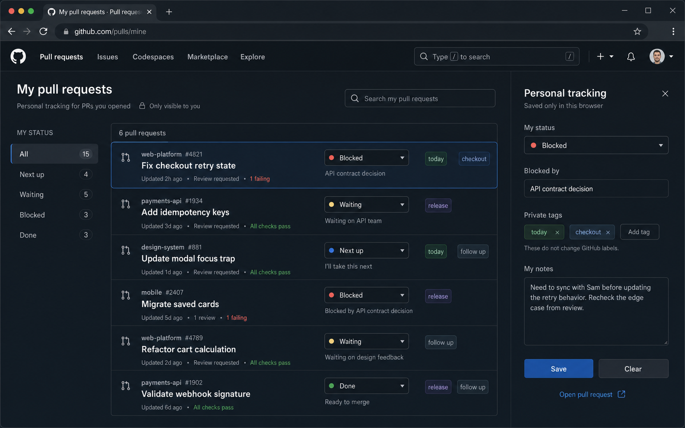

# GitHub PR Tracker

Personal Tampermonkey tracker for your own open Toast GitHub pull requests. It adds a bookmarkable `My tracker` view at `https://github.toasttab.com/pulls#pr-tracker`, keeps private workflow notes locally in Tampermonkey storage, and shows GitHub-native review/check/merge context only when the page data can confirm it.



## Install

- One-click install: [github-pr-tracker.user.js](https://raw.githubusercontent.com/NathanNorman/github-pr-tracker/main/dist/github-pr-tracker.user.js)
- Repo home: <https://github.com/NathanNorman/github-pr-tracker>
- Issues: <https://github.com/NathanNorman/github-pr-tracker/issues>

Tampermonkey may show a confirmation page when you open the raw `.user.js` link. That is expected.

Fallback import steps:

1. Install the Tampermonkey browser extension.
2. Open the raw install link above, or open `dist/github-pr-tracker.user.js` from a local clone.
3. Review the script header in Tampermonkey and confirm installation.
4. Visit `https://github.toasttab.com/pulls#pr-tracker`.

## Usage

- The script runs only on `github.toasttab.com/pulls*` and adds a `My tracker` entry that points to `/pulls#pr-tracker`.
- The tracker shows only your open authored pull requests from same-origin Toast GitHub results.
- Change personal status directly from the pull request list; choosing `Blocked` opens the private detail panel for blocker context.
- Use each row's `Open` link to go straight to the pull request without opening the personal detail panel first.
- Eligible, non-draft rows include a green `Merge` button. It uses the same confirmed native squash-merge flow as the detail panel and submits an empty commit-message body.
- Each row shows the current unresolved review-conversation count when GitHub's Files view can confirm it.
- Use `Refresh` to bypass the 10-minute detail cache and refetch current per-PR review/check/merge/thread state.
- Personal statuses are `unsorted`, `next_up`, `waiting`, `blocked`, and `done`.
- `Show completed` reveals `done` items without mixing them into the default active views.
- Click a private tag to filter by it.
- Use the compact `Filter` menu to hide draft PRs or narrow the list to one repository, review state, and checks state. Active filters compose with search, personal status, private tags, and the done-item setting; `Clear filters` resets the structured filter menu.
- Use the compact `Sort` menu to choose a primary group and an optional secondary order within each group. Repository grouping creates separate sections such as `toast-analytics` and `toast-archiving`; status, update timeframe, review, checks, title initial, and PR-number ranges can also be used as groups.
- Grouping defaults to newest update timeframe first, then repository within each section. Filter and sort selections are saved locally for the next visit.
- Press `Escape` or click outside to close Filter, Sort, Backup, or the personal PR panel.
- Green `Merge` and `Squash & merge` actions appear only when the cached GitHub state says a PR is mergeable. They re-check GitHub's native form, preserve GitHub's default squash title, clear the commit-message body, and require confirmation.
- `Close PR` opens an inline confirmation with an optional closing comment. GitHub's native combined comment-and-close form performs the action.

## Personal Data And Backup

- Personal notes, blocker text, statuses, private tags, filter preferences, and sorting preferences are stored locally in Tampermonkey storage, namespaced by signed-in GitHub account.
- Export/import uses versioned JSON and merges records by stable PR key `owner/repository#number`.
- Import never deletes unmatched local records and keeps the newest `modifiedAt` when the same PR exists in both places.

## Theme Behavior

- The UI is rendered in a scoped Shadow DOM.
- Styling inherits GitHub Primer CSS variables, so it follows GitHub light, dark, dimmed, high-contrast, colorblind, and system theme choices automatically.
- Private tags store semantic color keys, not raw theme-specific values.

## Privacy And Security

- No GitHub API token.
- Merge and close happen only after an explicit click through short-lived, same-origin GitHub forms protected by GitHub's authenticated session and CSRF token. Those tokens are never stored or exported.
- No personal notes, tags, blockers, or statuses are sent anywhere.
- All user-authored content is rendered with `textContent`, not HTML.
- Same-origin GitHub HTML fetches are used for open PR discovery and best-effort native-state extraction.

## Limitations

- Review/check/merge state is conservative by design. If embedded page data, semantic DOM content, or a same-origin deferred status source cannot confirm a field, that field stays `unknown`.
- Unresolved-thread counts are best-effort and stay hidden if GitHub's Files view cannot be parsed confidently.
- Native GitHub action forms are intentionally validated strictly. If GitHub changes their markup, merge/close fails without posting rather than guessing.
- Historical timeline reviews are intentionally ignored so old approvals or change requests are not mistaken for current state.
- GitHub UI changes may require selector or parser updates in future versions.

## Development

Requirements:

- Node.js with npm

Commands:

- `npm ci`
- `npm test`
- `npm run build`
- `npm run check:dist`

The build writes the tracked distributable to `dist/github-pr-tracker.user.js`.

## Project Structure

```text
dist/                Built userscript checked into the repo
docs/mockups/        Mockup PNGs for the tracker UI
scripts/             Build and distribution validation scripts
src/                 Runtime source modules
test/                Node test suite and HTML fixtures
```

## License

MIT. See [LICENSE](./LICENSE).
